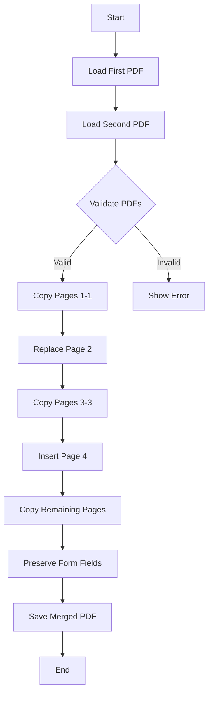
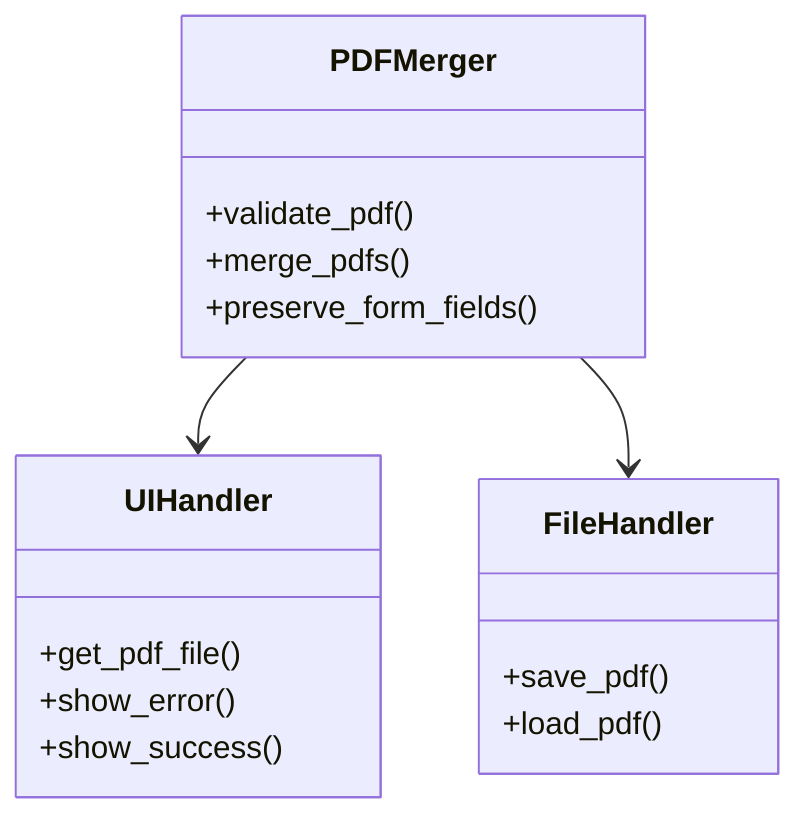
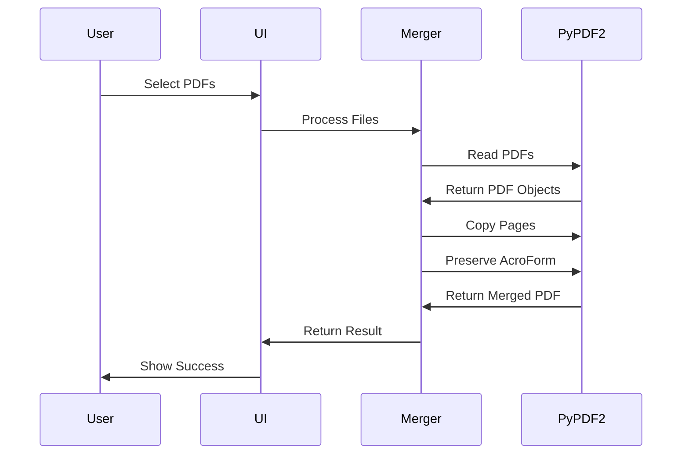

# Technical Journey: Building a PDF Merger with PyPDF2

## Project Overview

This technical narrative documents the development of a specialised PDF merger tool designed to handle form-enabled PDFs while preserving interactive form data. The project emerged from a specific requirement to merge 13-page PDFs with particular attention to page reordering and form field preservation.

## Initial Development Phase

The journey began with a fundamental challenge: creating a tool that could merge PDFs while maintaining the integrity of interactive form fields. The initial implementation utilised **PyPDF2**, a Python library chosen for its robust PDF manipulation capabilities. Early development focused on basic PDF merging functionality using **PdfReader** and **PdfWriter** classes.

## Technical Challenges and Evolution

### Form Field Preservation Challenge

The first significant hurdle emerged when attempting to preserve form data during the merging process. The initial approach using standard PyPDF2 page copying resulted in form fields being stripped from the output document. This led to the implementation of a form field preservation mechanism using **AcroForm** data structures.

### Page Ordering Requirements

A specific requirement emerged: the tool needed to perform two key operations:

1. Replace page 2 of the first document with page 2 of the second document
2. Insert page 4 of the second document after page 4 of the first document

This necessitated careful handling of page indexing and proper sequencing of merge operations.

### Error Resolution Journey

#### IndirectObject Error

The first major technical obstacle manifested as an **'IndirectObject' object is not iterable** error. This occurred during attempts to validate PDF content. The solution involved restructuring the validation approach to handle PDF objects more appropriately, focusing on direct page access rather than attempting to iterate through indirect objects.

#### PageObject Reader Attribute Error

The next challenge presented itself as a **'PageObject' object has no attribute 'reader'** error. This revealed a fundamental misunderstanding of PyPDF2's object model. The resolution required shifting from page-level operations to reader-level operations for form field management.

## Technical Implementation Details

### Core Components

#### PDF Validation

```python
def validate_pdf(pdf_path):
    """Simple validation - just check page count"""
    try:
        reader = PdfReader(pdf_path)
        return len(reader.pages) == 13
    except Exception as e:
        print(f"Validation error: {e}")
        return False
```

#### Form Field Preservation

The implementation evolved to handle form fields at the document level rather than the page level:

```python
if "/AcroForm" in doc1.trailer["/Root"]:
    merged_writer._root_object.update({
        NameObject("/AcroForm"): doc1.trailer["/Root"]["/AcroForm"]
    })
```

### User Interface Integration

The project incorporates a **tkinter**-based graphical interface for file selection and error reporting. This enhances usability whilst maintaining robust error handling:

```python
def get_pdf_file(prompt):
    root = tk.Tk()
    root.withdraw()
    file_path = filedialog.askopenfilename(
        title=prompt,
        filetypes=[("PDF files", "*.pdf")]
    )
    return file_path if file_path else None
```

## System Architecture and Flow

### PDF Merging Process



### Component Architecture



### Form Field Handling Process



## Learning Outcomes and Best Practices

The development process revealed several critical insights about PDF manipulation:

1. **PDF Structure Understanding**: The importance of comprehending PDF internal structures, particularly the relationship between pages and form fields.

2. **Error Handling Evolution**: The progression from basic error catching to comprehensive validation and error reporting demonstrates the importance of robust error handling in document processing applications.

3. **Form Data Preservation**: The complexity of maintaining interactive elements in PDFs led to a deeper understanding of PDF document structures and the **AcroForm** specification.

## Future Considerations

The project has potential for several enhancements:

- Implementation of batch processing capabilities
- Enhanced form field validation
- Support for different PDF versions and structures
- Integration of digital signature preservation

## Conclusion

This journey through PDF manipulation development illustrates the complexities of working with document formats that combine static content with interactive elements. The evolution of the code from basic merging to handling complex form preservation demonstrates the importance of iterative development and careful error handling in document processing applications.
