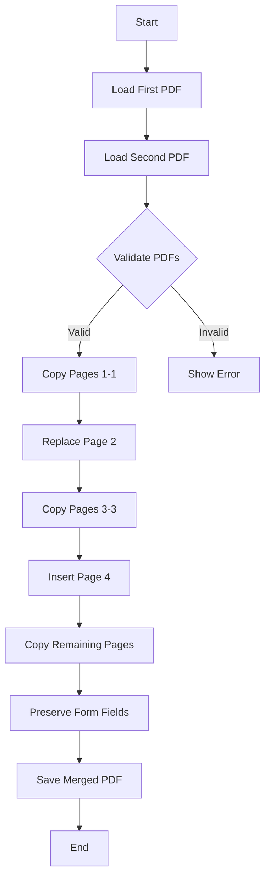
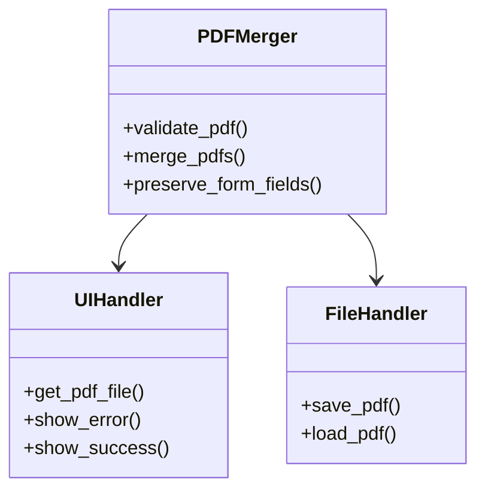

# Project Diagrams

## PDF Merging Process


## Component Architecture


## Form Field Handling Process
```mermaid
sequenceDiagram
    participant User
    participant UI
    participant Merger
    participant PyPDF2
    User->>UI: Select PDFs
    UI->>Merger: Process Files
    Merger->>PyPDF2: Read PDFs
    PyPDF2->>Merger: Return PDF Objects
    Merger->>PyPDF2: Copy Pages
    Merger->>PyPDF2: Preserve AcroForm
    PyPDF2->>Merger: Return Merged PDF
    Merger->>UI: Return Result
    UI->>User: Show Success
